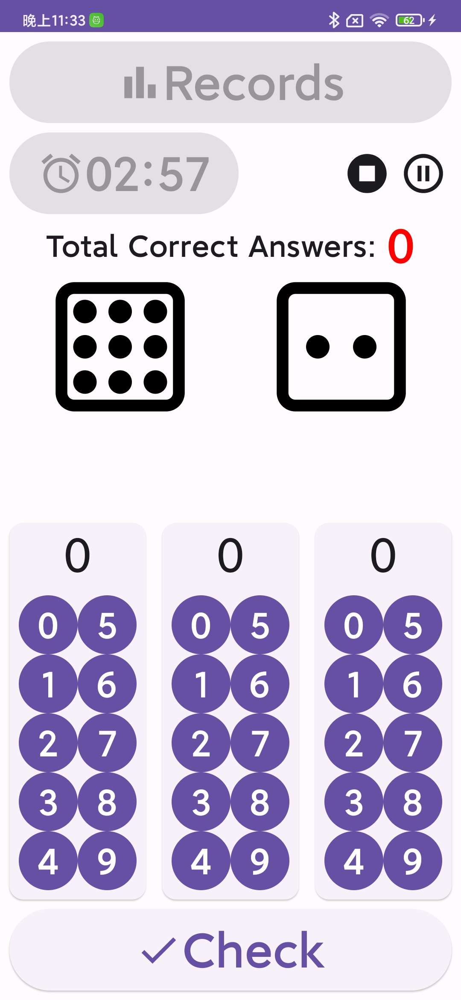

# OhChild

This is a simple math calculation practicing tool for children which only does the sum calculation
within 20.

## Features

1. Use dices showing number to have better feeling for children.
2. Set exercise period by press the clock button.
3. Record the exercise history to find children's grow.
4. Lively sound.

## Screenshot:

