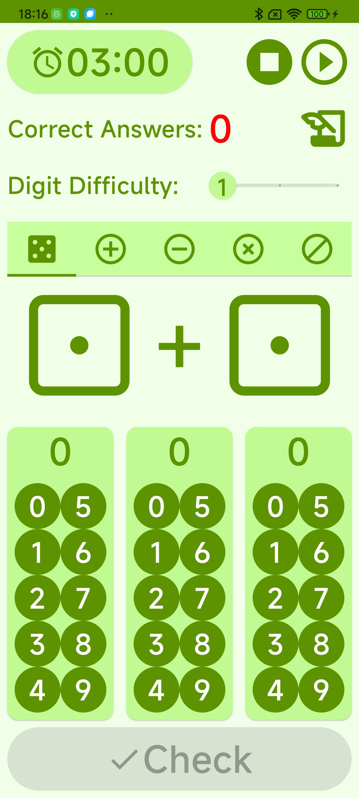
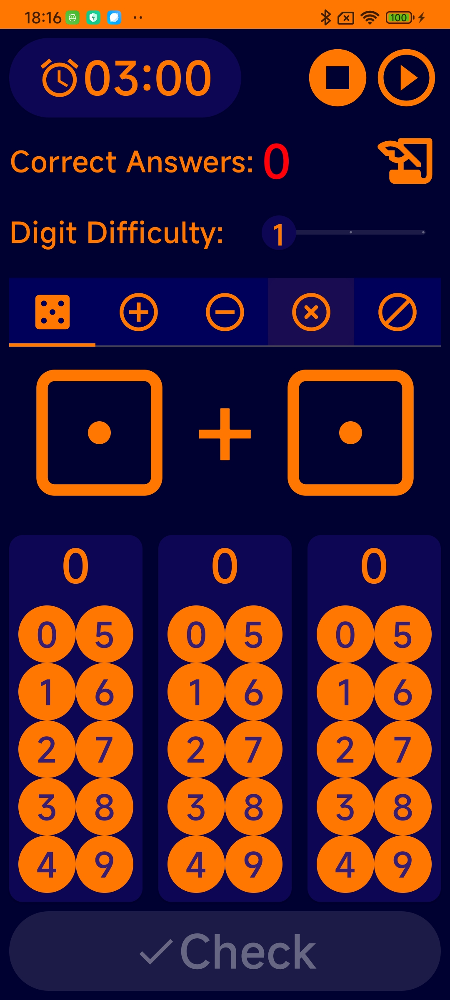

# OhChild

This is a simple math calculation practicing tool for 3~10 years old children.

It can practice plus, minus, multiplication and divide calculation.

We have three difficulty levels for each math method by setting the digit from 1 to 3.

Practicing time longer or shorter is up to you by setting the count down timer (the icon with a
clock).

There is easiest level for the beginner. It Uses dices to show number by dots to provide better
feeling for children.

Exercise history will be recorded to observe children's growth.

Lively sound for more fun.

Screenshots are below:

